# Background

It can be useful to run a post-hoc analysis where a tree posterior is available in the form of a NEXUS tree log file (as produced by BEAST), for example

* when a tree posterior is available from a previous analysis, but the sequence data is not.
* when estimating epidemiological parameters and using a computationally intensive tree prior, like compartimentalised models such as MASCOT.
* when you are interested in the ancestral reconstruction of internal nodes (e.g. a discrete trait analysis (DTA)) on a large tree, and another post-hoc DTA can be done quickly afterwards.

Be aware that using a tree posterior instead of using a joint analysis has the potential to result in biased estimates of the parameters of interest. Let the tree set be

In this tutorial, we will look at a phylogeographical reconstruction  of influenze HBV through Africa and Asia.

----

# Programs used in this Exercise

### BEAST2 - Bayesian Evolutionary Analysis Sampling Trees 2

BEAST2 is a free software package for Bayesian evolutionary analysis of molecular sequences using MCMC and strictly oriented toward inference using rooted, time-measured phylogenetic trees . This tutorial uses the BEAST2 version 2.6.3.

### BEAUti2 - Bayesian Evolutionary Analysis Utility

BEAUti2 is a graphical user interface tool for generating BEAST2 XML configuration files.

Both BEAST2 and BEAUti2 are Java programs, which means that the exact same code runs on all platforms. For us it simply means that the interface will be the same on all platforms. The screenshots used in this tutorial are taken on a Mac OS X computer; however, both programs will have the same layout and functionality on both Windows and Linux. BEAUti2 is provided as a part of the BEAST2 package so you do not need to install it separately.

### Tracer

Tracer is used to summarise the posterior estimates of the various parameters sampled by the Markov Chain. This program can be used for visual inspection and to assess convergence. It helps to quickly view median estimates and 95% highest posterior density intervals of the parameters, and calculates the effective sample sizes (ESS) of parameters. It can also be used to investigate potential parameter correlations. We will be using Tracer v1.7.0.

----

# Practical: Tree Set Analysis

We will set up an analysis in BEAUti using a fixed tree partition. We add a spherical geography partition, run BEAST and analyse the results. We will be using the FixedTreeAnalysis and GEO_SPHERE packages.

> * Start BEAUti
> * Click to the `File => Manage packages` menu item.
> * Select `FixedTreeAnalysis` in the list of packages and the click `Install` button.
> * Select `GEO_SPHERE` and the click `Install` button.
> * Close BEAUti -- it needs to restart to pick up the new packages.


## Set up in BEAUti

> Start BEAUti and select the `File => Templates => Tree Set Analysis` item

BEAUti should change to show it uses the Tree Set Analysis template.

<figure>
	<a id="fig:BEAUti1"></a>
	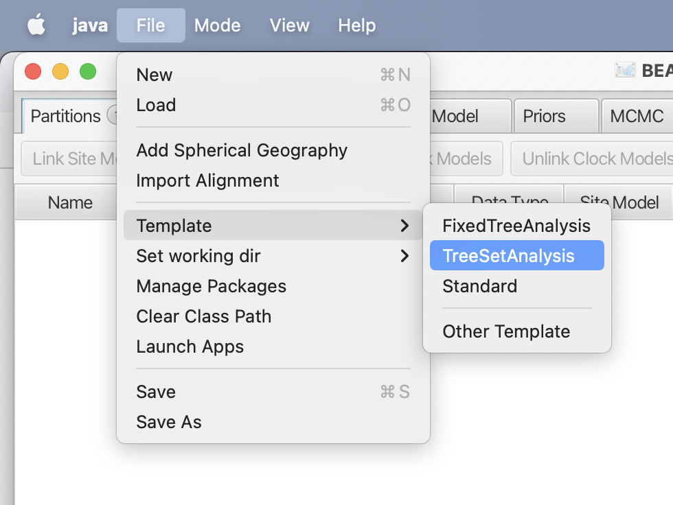
	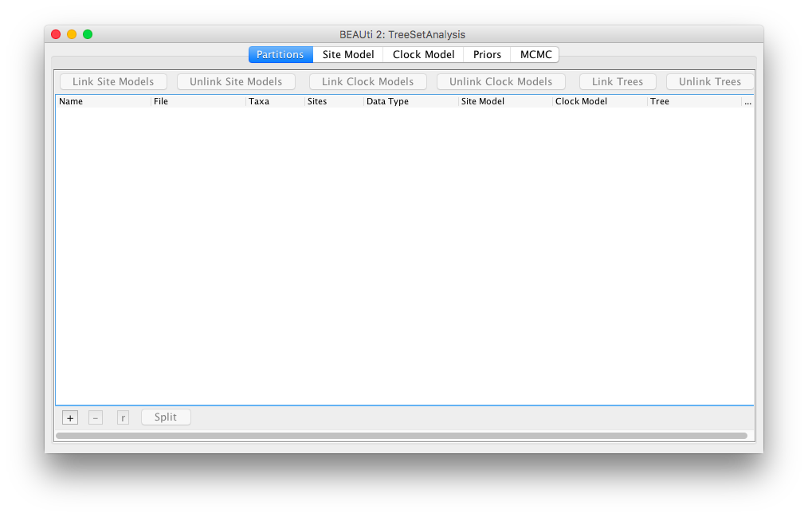
	<figcaption>Figure 1: Select the Tree Set Analysis template, and BEAUti changes its appearance.</figcaption>
</figure>


> Next, select the `File => Add Tree Set` menu.
A dialog is shown where you can select a file containing a tree set in NEXUS format.

> Select the file `HBVnogeo.trees` that comes with this tutorial in the data section.

<figure>
	<a id="fig:BEAUti2"></a>
	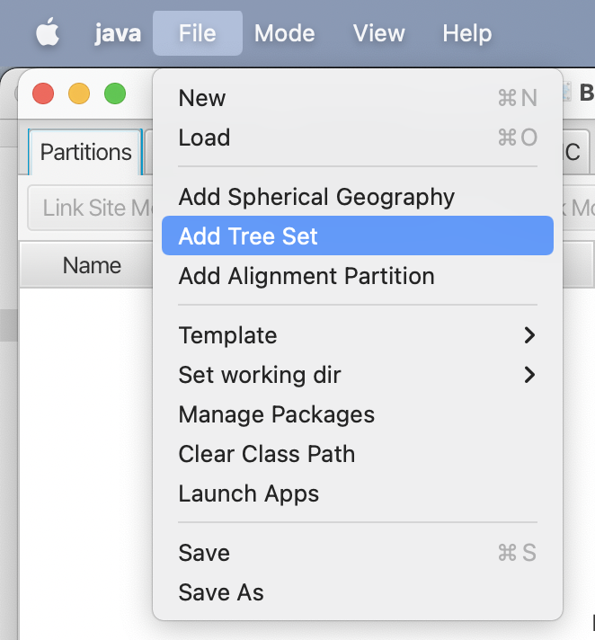
	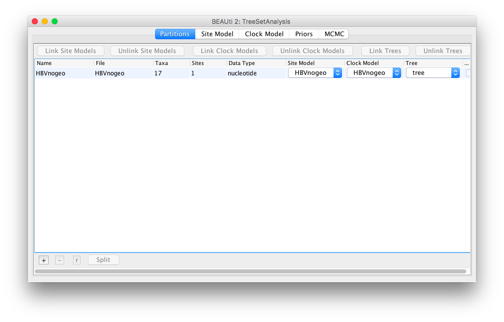
	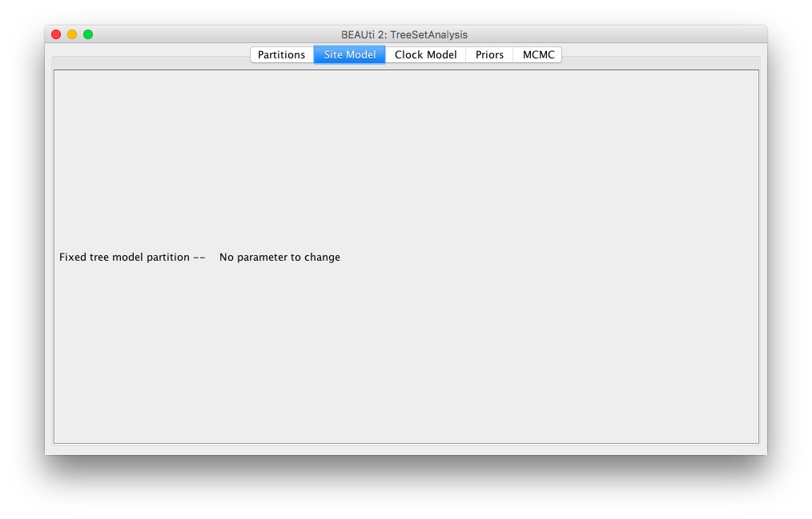
	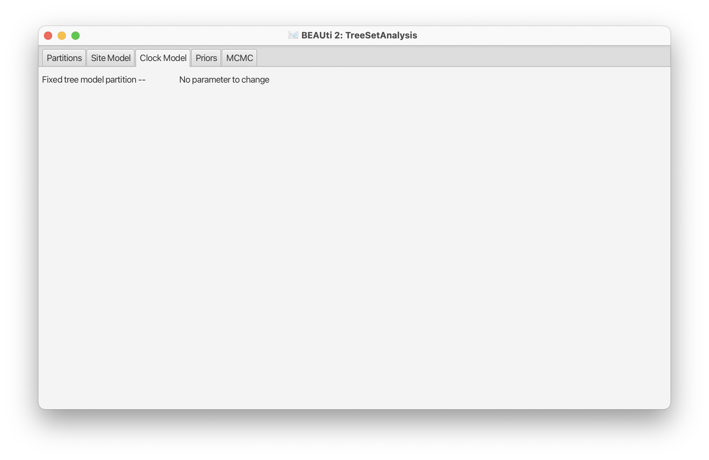
	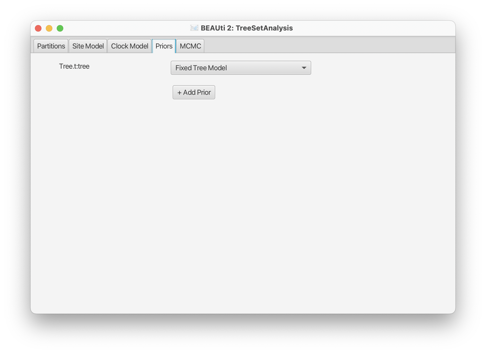
	<figcaption>Figure 2: Add Tree set partition through the `File => Add Tree Set` menu.</figcaption>
</figure>

In the partition panel, a new partition will be added with the name HBVnogeo. The site model and clock model panels will show entries for this partition that cannot be changed. The priors panel contains a dummy tree distribution, that will remain constant throughout the analysis. If you want to set up an analysis with an epidemiological tree prior, you can choose another tree prior and estimate parameters for this tree. Here, we will add another partition for a discrete trait.

> Select the `File => Add Spherical Geography` menu.

<figure>
	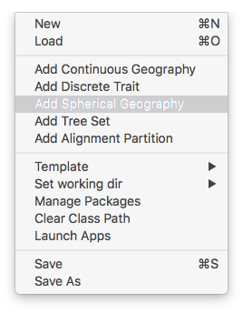
</figure>

A dialog is shown to set up the name. Choose `geo`. There is only a single tree in the system, so no need to change it. When adding other skinds of partitions, it may be necessary to select the tree set partition, or after adding the partition, to select all partitions and use the `Link Trees` button.

<figure>
	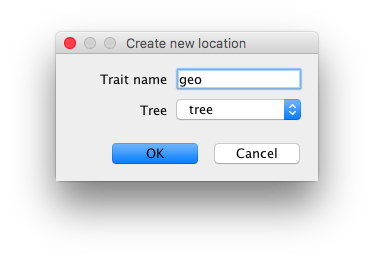
</figure>

Next, a dialog is shown where you can set up the trait. Since there are quite a few taxa, we will set them based on information in the taxon names.

> * Choose the `Guess latitude` button.
> * Select `split on character`.
> * Choose `3` for the groups to take.
> * Select the `OK` button.

> * Now repeat something similar for the longitude: choose the `Guess longitude` button.
> * Select `split on character`.
> * Choose `4` for the groups to take.
> * Click `OK`.
> * All location entries are now populated. Select the `Close` button.discrete-trait

<figure>
	<a id="fig:BEAUti3"></a>
	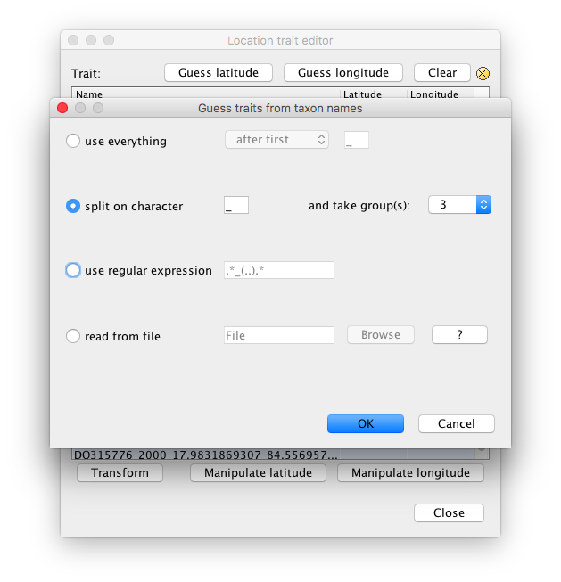
	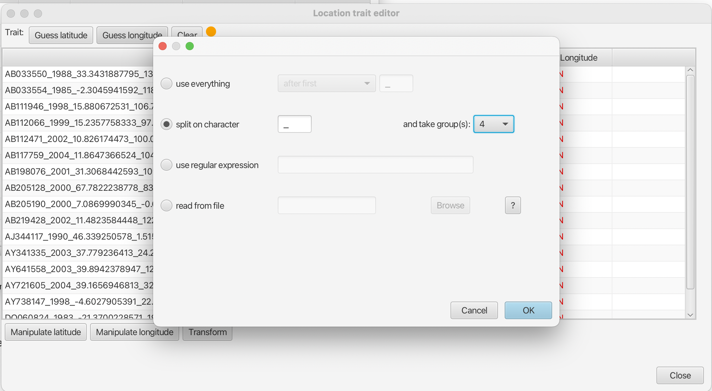
	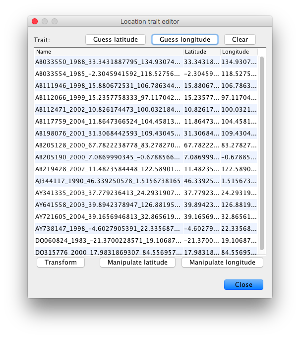
	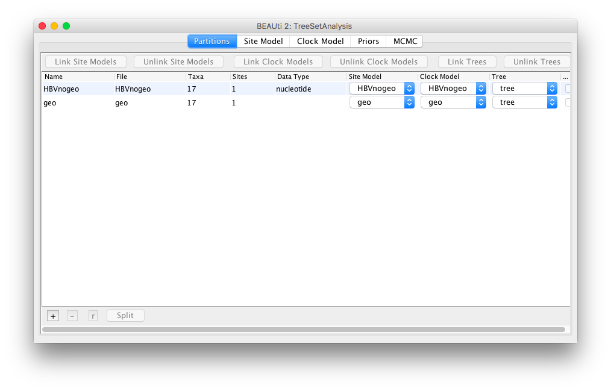
	<figcaption>Figure 3: Set up locations. A new partition will be added.</figcaption>
</figure>

A second partition should now have been added to the partitions panel. If necessary, the site model and its parameters can be changed in the site model panel, and the clock model in the clock model panel for the geography partition. For this tutorial, we will keep the site model unchanged, but change the clock model to a relaxed clock with log normally distributed rates.

> * Select the clock model panel
> * Selec the `geo` partition in the list on the left
> * Change the clock  model from `Strict clock` to `Relaxed Clock Log Normal`

<figure>
	<a id="fig:BEAUti4"></a>
	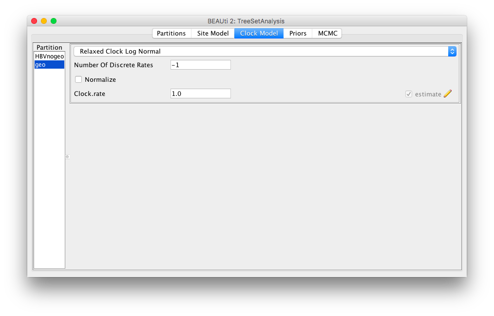
	<figcaption>Figure 4: Geography clock model settings.</figcaption>
</figure>


Since the analysis will converge quite quickly, we do not need the default 10 million samples.

> * In the MCMC panel, set the chainLength to 1Figure 2 million samples.
> * Optionally, you might want to reduce the log frequency of the screen logger to 100000.
> * Safe the file to `HBVtreeset-geo.xml`

<figure>
	<a id="fig:BEAUti5"></a>
	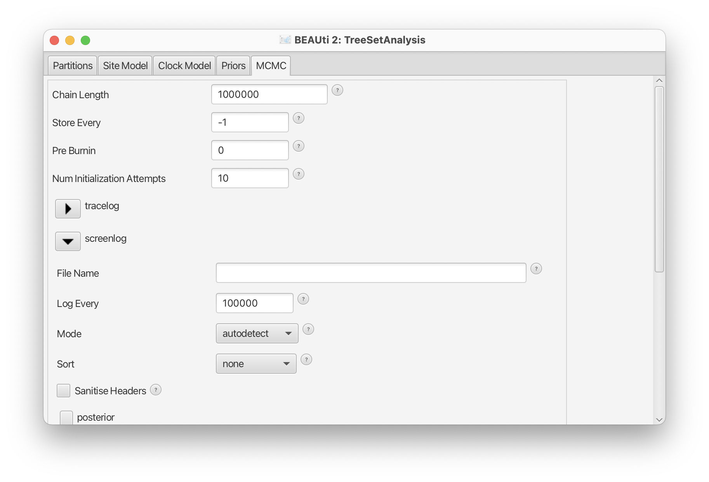
	<figcaption>Figure 5: MCMC settings.</figcaption>
</figure>


## Run with BEAST

> Run BEAST on `HBVtreeset-geo.xml`

This should not take too long.

## Check convergence

> Run `Tracer`, and make sure all parameters have sufficiently large ESSs

<figure>
	<a id="fig:Tracer"></a>
	
	<figcaption>Figure 6: Convergence of MCMC in Tracer.</figcaption>
</figure>


## Comparison with joint analysis


To visualise the result, we can use the HeatMapMaker app that comes with the GEO_SPERE package.
A background map can be downloaded from `https://www.cs.auckland.ac.nz/~remco/geo/World98.png`.
You can run HeatMapMaker from a terminal through `applauncher` (which comes with BEAST), like so:

```
applauncher HeatMap -tree HBVtreeset-geo.trees -tag locationsgeo -back World98.png -bound -30,-30,70,160 -width 1024 -height 512
```

or you can start it from BEAUti:

> * Select the `File => Launch apps` menu.
> * Select the HeatMapMaker tool from the dialog that pops up.
> * Select the launch button. A dialog pops up showing all the options that HeatMapMaker provides.
> * Fill in entries as appropriate:
>     * use the `browse` button to set tree to Figure 2`HBVtreeset-geo.trees`,
>     * use `browse` button to set background to `World98.png`,
>     * enter `locationsgeo` to tag,
>     * set bounding box to `-30,-30,70,160`,
>     * set width to `1024`, set height to `512`,
>     * set any other options to your liking.
> * Select the `OK` button, and result will be created in `heatmap.png`.

<figure>
	<a id="fig:HeatMap"></a>
	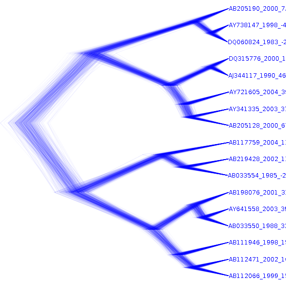
	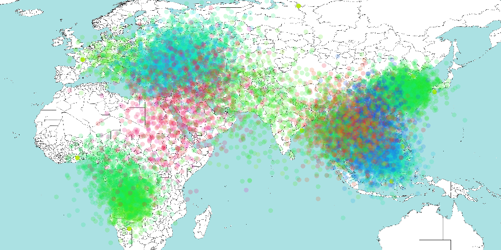
	
	<figcaption>Figure 7: Heat map of the  locations in the HBV geography reconstruction.
	Tree set based first, joint geography/sequeFigure 2nce heatmap next.</figcaption>
</figure>

When we compare the reconstruction of the joint geography with sequence analysis with the tree set analysis, there is hardly any difference between them, other than can be expected due to the stochastic nature of the MCMC algorithm.

In this case, when looking at the tree set in DensiTree, it shows that the topology and internal node heights are mainly driven by the sequence data, and the geography partition has little effect on the tree. Therefore, the tree set analysis does not differ substantially from the joint analysis.

Be aware that if there is less signal in the data that produced the tree set, or if the partition added to the tree set analysis has very informative data, it is recommended to perform the joint analysis if possible.

----
# Useful Links

- BEAST 2 website and documentation: [http://www.beast2.org/](http://www.beast2.org/)
- [Bayesian Evolutionary Analysis with BEAST 2](http://www.beast2.org/book.html) 
- Join the BEAST user discussion: [http://groups.google.com/group/beast-users](http://groups.google.com/group/beast-users)

----

# Relevant References


