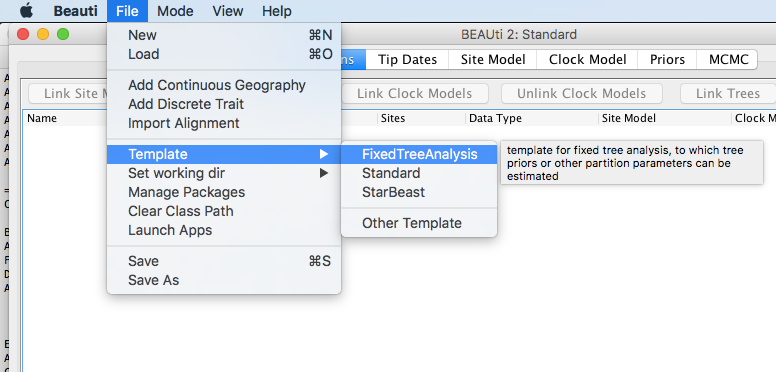
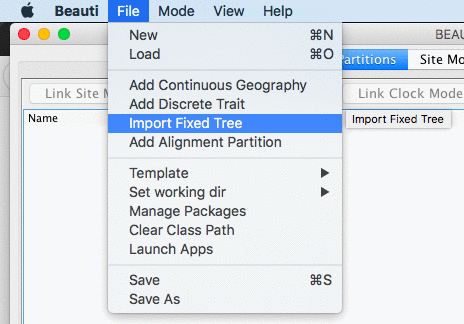

# Background

It can be useful to run an analysis where the tree is fixed, for example

* when a tree is available from a previous analysis, but the sequence data is not.
* when estimating epidemiological parameters and using a computationally intensive tree prior, like compartimentalised models (e.g. MASCOT).
* when you are interested in the ancestral reconstruction of internal nodes (e.g. a discrete trait analysis (DTA)) on a large tree, and the joint analysis takes longer than a separate BEAST analysis to infer a tree, and another post-hoc DTA can be done quickly afterwards.

Be aware that using a single tree means that not all of the uncertainty in the tree posterior is captured, and there may be bias towards being over-confident in results.

In this tutorial, we will look at a phylogeographical reconstruction  of influenze H5N1 in China.

----

# Programs used in this Exercise

### BEAST2 - Bayesian Evolutionary Analysis Sampling Trees 2

BEAST2 is a free software package for Bayesian evolutionary analysis of molecular sequences using MCMC and strictly oriented toward inference using rooted, time-measured phylogenetic trees . This tutorial uses the BEAST2 version 2.6.3.

### BEAUti2 - Bayesian Evolutionary Analysis Utility

BEAUti2 is a graphical user interface tool for generating BEAST2 XML configuration files.

Both BEAST2 and BEAUti2 are Java programs, which means that the exact same code runs on all platforms. For us it simply means that the interface will be the same on all platforms. The screenshots used in this tutorial are taken on a Mac OS X computer; however, both programs will have the same layout and functionality on both Windows and Linux. BEAUti2 is provided as a part of the BEAST2 package so you do not need to install it separately.

### Tracer

Tracer is used to summarise the posterior estimates of the various parameters sampled by the Markov Chain. This program can be used for visual inspection and to assess convergence. It helps to quickly view median estimates and 95% highest posterior density intervals of the parameters, and calculates the effective sample sizes (ESS) of parameters. It can also be used to investigate potential parameter correlations. We will be using Tracer v1.7.0.

----

# Practical: Fixed Tree Analysis

We will set up an analysis in BEAUti using a fixed tree partition. We add a DTA partition, run BEAST and analyse the results. We will be using the FixedTreeAnalysis and 	BEAST-classic packages.

> * Start BEAUti
> * Click to the `File => Manage packages` menu item.
> * Select `FixedTreeAnalysis` in the list of packages and the click `Install` button.
> * Select `BEAST_CLASSIC` and the click `Install` button.
> * Close BEAUti -- it needs to restart to pick up the new packages.

## Set up in BEAUti

> Start BEAUti and select the `File => Templates => Fixed Tree Analysis` item

BEAUti should change to show it uses the Fixe Tree Analysis template.

<figure>
	
	
	
	<figcaption>Figure 1: Select the Fixed Tree Analysis template, and BEAUti changes its appearance.</figcaption>
</figure>

> Next, select the `File => Import Fixed Tree` menu.
A dialog is shown where you can select a file containing a tree in NEXUS format.

> Select the file `H5N1.tree` that comes with this tutorial in the data section.

<figure>
	
	
	
	<figcaption>Figure 2: Add Fixed Tree partition through the `File => Import Fixed Tree` menu.</figcaption>
</figure>

In the partition panel, a new partition will be added with the name H5N1. The site model and clock model panels will show entries for this partition that cannot be changed. The priors panel contains a dummy tree distribution, that will remain constant throughout the analysis. If you want to set up an analysis with an epidemiological tree prior, you can choose another tree prior and estimate parameters for this tree. Here, we will add another partition for a discrete trait.

> Select the `File => Add Discrete Trait` menu.

<figure>
	
</figure>

A dialog is shown to set up the name. Choose `geo`. There is only a single tree in the system, so no need to change it. When adding other kinds of partitions, it may be necessary to select the fixed tree, or after adding the partition, to select all partitions and use the `Link Trees` button.

<figure>
	
</figure>

Next, a dialog is shown where you can set up the trait. Since there are quite a few taxa, we will just load them from the `H5N1locations.dat` file in the data directory.

> * Choose the `Guess` button.
> * Select `read from file`
> * Select the `Browse` button, and navigate to the `H5N1locations.dat` file in the data section of this tutorial.
> * Select the `OK` button.
> * All location entries are now populated. Select the `Close` button.

<figure>
	
	
	
	
	<figcaption>Figure 3: Set up DTA locations.</figcaption>
</figure>

A second partition should now have been added to the partitions panel. If necessary, the site model and its parameters can be changed in the site model panel, and the clock model in the clock model panel for the DTA partition. However, for this tutorial, we will keep things simple and use the default site model, clock model and priors.

Since the analysis will converge quite quickly, we do not need the default 10 million samples.

> * In the MCMC panel, set the chainLength to 1 million samples.
> * Change to log frequency of the `treeWithTraitLog` to 1000.
> * Optionally, you might want to reduce the log frequency of the screen logger to 100000.
> * Safe the file to `H5N1-dta-fixed-tree.xml`

<figure>
	
	
	<figcaption>Figure 4: MCMC settings.</figcaption>
</figure>

## Run with BEAST

> Run BEAST on `H5N1-dta-fixed-tree.xml`

This should not take too long.

## Check convergence

> Run `Tracer`, and make sure all parameters have sufficiently large ESSs

<figure>
	
	
	<figcaption>Figure 5: Convergence of MCMC in Tracer.</figcaption>
</figure>

## Comparison with joint analysis

Let's compare the estimated rates with those of the full joint analysis (that is, the analysis where both the tree and the ancestral reconstruction is estimated. The following table shows rate estimates for the current fixed rate analysis, rate estimates for the joint analysis and the relative difference between estimates. Though most of the estimates are in the right direction (large rates for fixed analysis are large for the joint), there is still a reasonable large difference. Part can be explained by the stochasticity of the estimates.

|------|------|------|------|
|transition|Fixed rate| Joined rate| relative diff |
|------|------|------|------|
Fujian_Guangdong	|	1.652	|	1.633	|	1.15%	|
Fujian_Guangxi		|	0.82	|	0.664	|	19.02%	|
Fujian_Hebei		|	0.912	|	0.884	|	3.07%	|
Fujian_Henan		|	0.655	|	0.631	|	3.66%	|
Fujian_HongKong		|	6.98E-02|	5.49E-02|	21.35%	|
Fujian_Hunan		|	0.207	|	0.209	|	0.97%	|
Guangdong_Guangxi	|	0.885	|	0.899	|	1.58%	|
Guangdong_Hebei		|	0.187	|	0.161	|	13.90%	|
Guangdong_Henan		|	0.118	|	0.12	|	1.69%	|
Guangdong_HongKong	|	7.74E-02|	9.63E-02|	24.42%	|
Guangdong_Hunan		|	5.40E-0	|	6.30E-02|	16.67%	|
Guangxi_Hebei		|	0.137	|	0.12	|	12.41%	|
Guangxi_Henan		|	9.12E-02|	0.106	|	16.23%	|
Guangxi_HongKong	|	0.198	|	0.193	|	2.53%	|
Guangxi_Hunan		|	0.174	|	0.157	|	9.77%	|
Hebei_Henan			|	0.611	|	0.638	|	4.42%	|
Hebei_HongKong		|	6.37E-03|	5.98E-03|	6.12%	|
Hebei_Hunan			|	0.288	|	0.294	|	2.08%	|
Henan_HongKong		|	3.58E-03|	3.96E-03|	10.61%	|
Henan_Hunan			|	0.698	|	0.687	|	1.58%	|
HongKong_Hunan		|	3.55E-03|	4.36E-03|	22.82%	|
|------|------|------|------|

Comparing the summary trees, we see that the reconstruction of most likely state is very similar. Also, probabilities of the most likely state at internal nodes matches fairly well. All things considered, the DTA reconstruction is very similar for fixed tree and joint tree analyses.

<figure>
	
	
	
	<figcaption>Figure 6: MCC tree annotated with locations. Fixed tree left, joint tree right.</figcaption>
</figure>

Note that in this case the DTA results do not differ very much between fixed tree and joint analyses. For example, continuous phylogeography through random walks will be more sensitive to uncertainty in the tree distribution.

----

# Useful Links

- BEAST 2 website and documentation: [http://www.beast2.org/](http://www.beast2.org/)
- [Bayesian Evolutionary Analysis with BEAST 2](http://www.beast2.org/book.html) 
- Join the BEAST user discussion: [http://groups.google.com/group/beast-users](http://groups.google.com/group/beast-users)

----

# Relevant References


